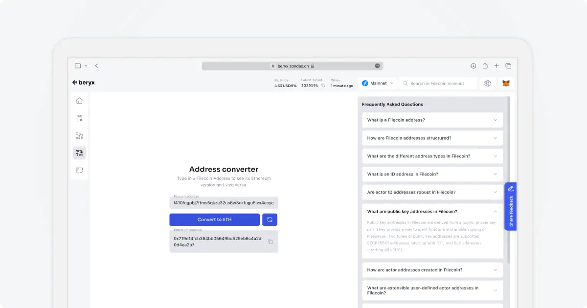

# Accounts/Addresses

Accounts are an integral part of the Filecoin ecosystem, serving as the foundation for various interactions and transactions. In Beryx, you can gain valuable insights into Filecoin accounts, whether they are user wallets, smart contract internal actors, or others. By simply entering the account address in the search bar, you can access a wealth of information related to that account.

> Filecoin has five address classes, and actors tend to have multiple addresses. Furthermore, each address class has its own rules for converting between binary and text. - [docs.filecoin.io](https://docs.filecoin.io)

To find out more about addresses, check the FAQ section on the [address converter page](https://beryx.zondax.ch/address_converter).

Read more about address classes [here](https://docs.filecoin.io/smart-contracts/filecoin-evm-runtime/address-types/).

Read more about actor types [here](https://docs.filecoin.io/smart-contracts/filecoin-evm-runtime/actor-types/).

## Address Page

The Address Page contains four tabs:

- **Overview**
- **All Transactions**
- **Mempool**
- **Stats**

View an address example [here](https://beryx.zondax.ch/search/fil/mainnet/address/f3u54wclxf5osictiuptwyhnu5nmdma6cdum4n7pdmanmflqt25srrtlwxjur5uhly2k476dhfwrierfa6o5pa).

### Overview Tab

The Overview tab provides a summary of the account, including:

- **Address ID**: The unique identifier for the account.
- **Actor Type**: The type of actor the account is.
- **Balance**: The current balance of the account.
- **Number of Transactions**: The total number of transactions associated with the account.

### All Transactions Tab

The All Transactions tab displays a table with all transactions related to the account. Each entry in the table includes details such as transaction hash, timestamp, amount, and status.

### Mempool Tab

The Mempool tab shows a table with all pending transactions for the account. These are transactions that have been initiated but not yet included in a block.

### Stats Tab

The Stats tab provides charts visualizing the account's activity. This includes:

- **Gas Consumption Chart**: A chart showing the account's gas usage over time.
- **Transactions Received**: Showing the number of transactions received by the account over time.
- **Transactions Sent**: Showing the number of transactions sent from the account over time.
- **Balance Chart**: A chart showing the account's balance over time.
- **Contracts Created**: The number of contracts created by the account.

