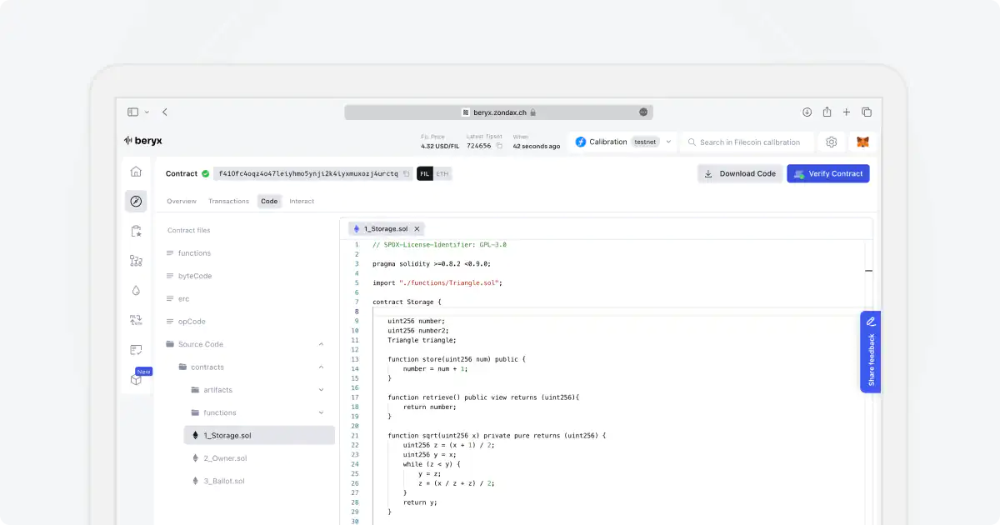

# Smart Contracts

In Beryx, you can view details and interact with Filecoin smart contracts.

## Searching for a Smart Contract

When searching for a smart contract, you can access the contract's source code, `ABI` (Application Binary Interface), and available methods.

## Smart Contract Page

The Smart Contract page contains similar information to the Address page, but with additional features specific to smart contracts. It includes the following tabs:

- **Overview**: Provides a summary of the smart contract, including its address ID, actor type, balance, and number of transactions.
- **All Transactions**: Displays a table with all transactions related to the smart contract. Each entry in the table includes details such as transaction hash, timestamp, amount, and status.
- **Mempool**: Shows a table with all pending transactions for the smart contract. These are transactions that have been initiated but not yet included in a block.
- **Stats**: Provides charts visualizing the smart contract's activity. This includes gas consumption over time, transactions received, transactions sent, balance over time, and contracts created.
- **Code**: View the source code of the smart contract, as well as its `ABI` (Application Binary Interface).
- **Interact**: Enables you to interact with the smart contract directly, calling its methods or functions.

## Searching a Smart Contract

You can search for a specific smart contract using its address and view its details and functionalities. Find a contract example [here](https://beryx.zondax.ch/search/fil/mainnet/address/f410fg6dyyyr5q7k6tg7kmavzw4uimz3phxxqmfk2mky?tab=overview).

## Interacting with a Smart Contract

In addition to viewing the source code and `ABI`, you can interact with smart contracts directly, call contract methods or functions.

Interact with contract `f410f...urctq` [here](https://beryx.zondax.ch/search/fil/calibration/address/f410fc4oqz4o47leiyhmo5ynji2k4iyxmuxozj4urctq?tab=interact).

## Verifying a Smart Contract

Verifying smart contracts is key to making sure the contracts you're dealing with are legit. Beryx makes sure that the deployed contract matches its source code.

Visit [Beryx Contract Verifier](https://beryx.zondax.ch/contract_verifier) to verify your contract or to see the list of verified contracts.

## Steps to Verify a Smart Contract

To verify a smart contract, you need to follow 3 easy steps:

1. **Upload the source code**: You have to upload the source code. This can be either a single .sol file, or in case you have a more complex contract, then please compress it into a .zip format and then upload it.
2. **Upload the metadata file**: Select if you have a metadata .json file or not. This file can be found in Remix after you compiled a contract and it contains the metadata from the output of Solidity compilation: compiler version, license, number of optimization steps, etc. If you have the file, just upload the .json file and you're all set. In case you don't have the file, you have to specify the entry file name, the compiler version, the license, and the desired optimization.
3. **Verify the contract**: If all information is set, then the button will turn blue, which means you're ready to verify your contract.

## Verification Success

If the verification process was successful, you'll see a green check next to your smart contract address, and you'll be able to visualize and download the source code.

