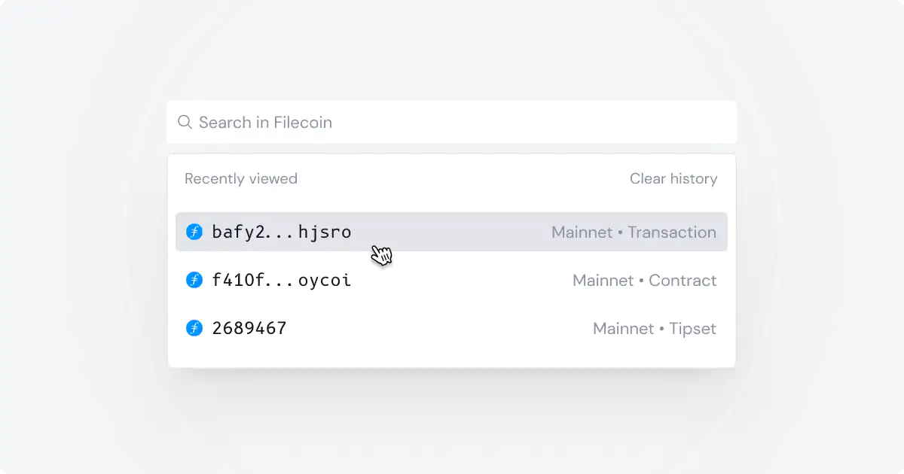
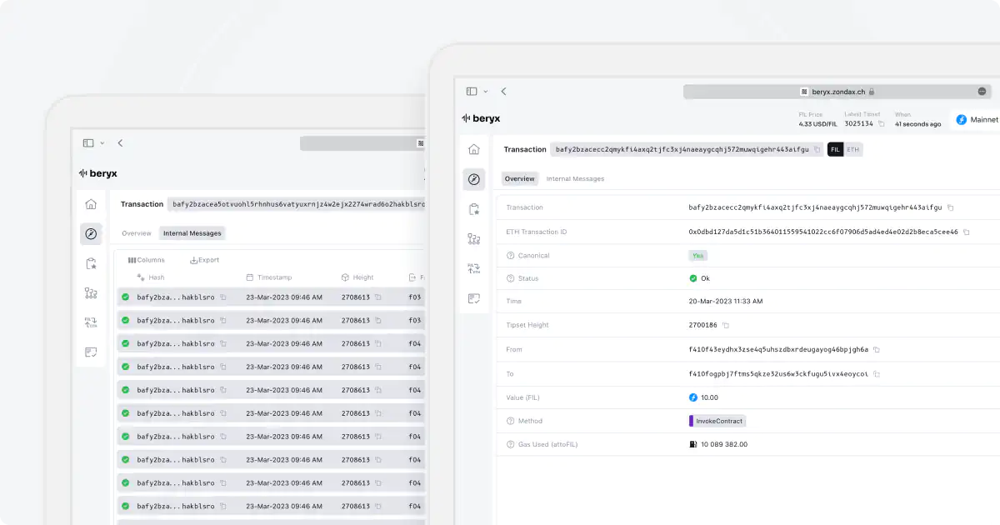

# Transactions

With Beryx, you can search for specific transactions within the Filecoin network.

Simply enter the relevant identifiers, such as transaction hash, account address (if you know the sender or receiver), or the tipset, into the search bar.

When using Beryx's search feature, it's important to note the network selection in the navigation bar. Ensure that you have chosen the appropriate network before searching.

Transaction example [here](https://beryx.zondax.ch/v1/search/fil/mainnet/txs/bafy2bzaceab3xcn7qkcuj5oyifa6dn3ihke55bdmerphef4r6aorjdhk3uriq?tab=overview).

Transaction Page contains:

- **Transaction Overview**
- **Internal Messages**
- **Logs**

## Overview Tab

Let's have a look at each item in the Overview Tab:

- **Amount**: The quantity of Filecoin tokens involved in the transaction.
- **Canonical**: Indicates whether the transaction is part of the canonical chain.
- **Gas used**: The value that represents the amount of gas used (attoFIL) in the transaction.
- **Hash**: It is a unique string identifier for the transaction.
- **Height**: Height at which the transaction was executed.
- **Status**: This string describes the status of the transaction, indicating whether it is confirmed, failed, or in the mempool.
- **From**: Represents the sender's address or account from which the transaction originates.
- **To**: The recipient's address or account to which the transaction is directed.
- **Transaction Type**: Specifies the type/category/method of the transaction.
- **Transaction Timestamp**: (string) Indicates the timestamp or time at which the transaction occurred.
- **Transaction Hash**: Uniquely identifies the transaction.
- **Transaction Parameters**: It can be a string or null value and represents the parameters or additional data provided with the transaction.
- **Transaction Return**: This string represents the return value or result of the transaction.

## Internal Messages Tab

The Internal Messages tab contains a table with internal messages associated with the transaction. Each entry in the table shows:

- **Transaction Hash**: A unique identifier for each internal message.
- **Timestamp**: The time at which the internal message was recorded.
- **Height**: The blockchain height at which the internal message was included.
- **From**: The sender address.
- **To**: The recipient address.
- **Method**: The type of internal message.
- **Amount**: The quantity of FIL tokens transferred.
- **Gas Used**: The amount of gas consumed.

## Logs Tab

Here you'll find the logs of the transaction.

