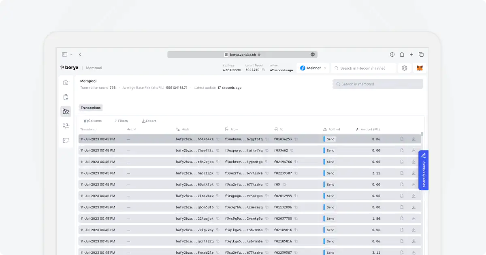

# Mempool

The Mempool acts as an intermediary between Filecoin nodes and the peer-to-peer network. It facilitates the off-chain propagation of messages among nodes. Essentially, the message pool allows nodes to maintain a collection of messages that they intend to transmit to the Filecoin Virtual Machine and subsequently include in the blockchain for on-chain execution.

Visit the [Mempool Page](https://beryx.zondax.ch/v1/mempool).

Find out more about the mempool [here](https://spec.filecoin.io/systems/filecoin_blockchain/message_pool/#:~:text=The%20Message%20Pool%2C%20or%20mpool,for%20off%2Dchain%20message%20propagation.).

