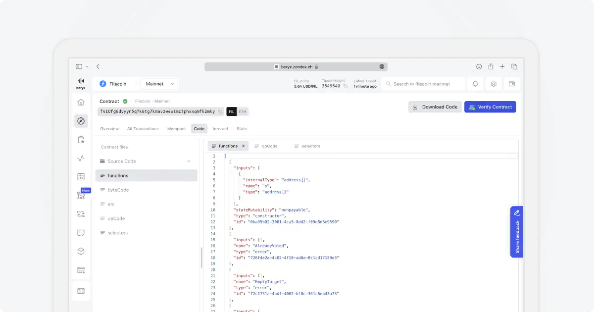
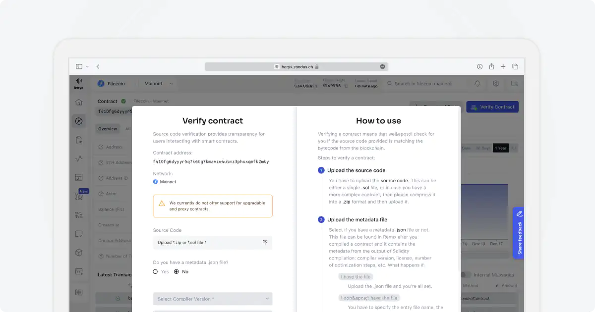
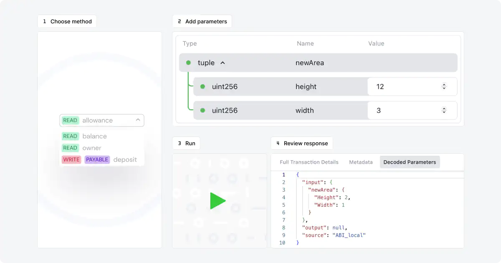

 # Interact with Smart Contracts
 Invoke methods on the Filecoin network by calling smart contracts. After executing a method, you can view the response and transaction details directly.
 
 ## How to interact with a smart contract
 First, find your contract using its address and go to the `Interact` tab. On the right side, you'll find a panel to run a method, and on the left side, a list of the latest transactions.

 ### Step 1: Decode Contract Functions
 In the interact section, we automatically decode your smart contract's functions based on its bytecode. This lets you visualize and pick the methods you want to call.

 ### Step 1*: Verify your contract to have access to all the methods
 To verify your contract, you can hit the verify button on top or head over to the Contract verifier page found in the left sidebar. 

 1. Upload the source code file (.sol) or the project archive (.zip).
 2. If you have the metadata file generated at compilation time, upload it.
 3. If you don't have the metadata file, manually fill out the form. You will need to specify:
    - The compiler version
    - The license
    - The contract name
    - Optimization details

 ### Step 2: Pick the Method Type
 Methods are grouped by type: `read`, `write`, `payable`, `pure`.

 ### Step 3: Choose the Method
 After picking the type, you'll see a dropdown with a list of methods and pick one.

 ### Step 4: Add parameters
 Some methods may need parameters. Below, you'll find a table with all the methods. This view is easy to understand and quick to fill out, thanks to the ABI and the verification process. If you'd rather add all the parameters in one go, just hit the "Switch to Text Input" button. This button will swap the table for a text input.

 ### Step 4: Run/call the method
 To call the selected method, you'll need to connect your wallet. This makes sure you have the funds and permissions to run write methods. If you're short on funds, no worries – you can visit our testnet faucet [here](https://beryx.zondax.ch/faucet) to get some test FIL. The faucet for Filecoin Calibration is found in the sidebar. You can also connect your wallet from the top bar. There, you'll find your balance and transactions.
 

 ## Checking Out Responses and Transaction Details
 The response from the method call will show up in the right panel. For write methods, the transaction details will also be displayed in a table. If you want to dig deeper into the transaction, click the "code view" button on a particular row to see the full transaction details.
